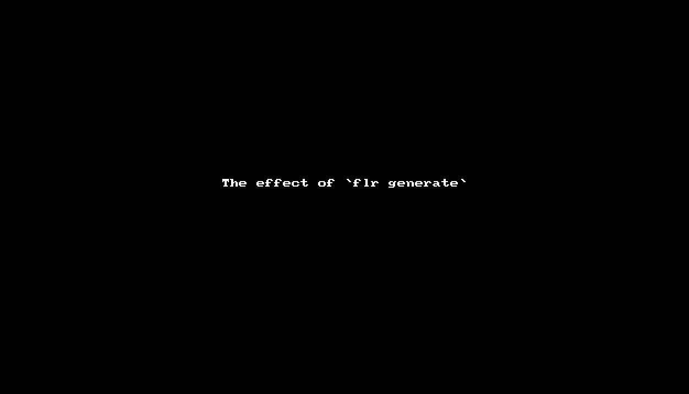
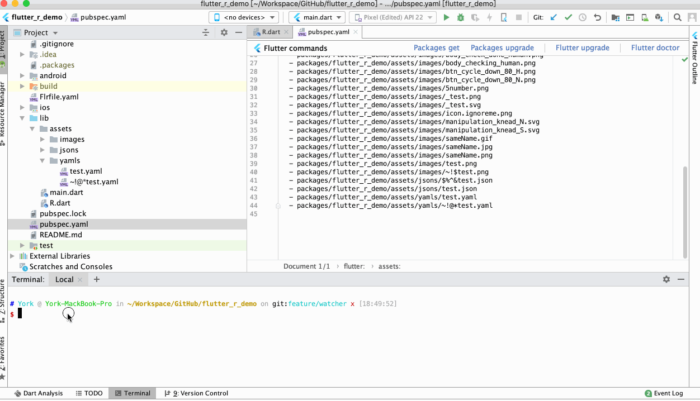

# Flr

 [](http://badge.fury.io/rb/flr) [](https://opensource.org/licenses/MIT)


Flr (Flutter-R): a CLI tool likes `AAPT`(Android Asset Packaging Tool), which can help flutter developer to auto specify assets in `pubspec.yaml` and generate `R.dart` file after he changes the flutter project assets. With `R.dart`,  flutter developer can apply the asset in code by referencing it's asset ID..






📖 *Read this in other languages: [English](README.md),  [简体中文](README.zh-cn.md)*

## Feature

- Support for two triggers (manual trigger and monitor trigger) to auto specify assets in `pubspec.yaml` and generate  `R.dart` file

- Support for monitoring the asset changes

- Support for processing image assets ( `.png`, `.jpg`, `.jpeg`, `.gif`, `.webp`, `.icon`, `.bmp`, `.wbmp`, `.svg` ) 

- Support for processing text assets ( `.txt`, `.json`, `.yaml`, `.xml` ) 

- Support for processing [image asset variants](https://flutter.dev/docs/development/ui/assets-and-images#asset-variants)

- Support for processing asset which’s filename is bad:
   - filename has illegal character (such as  `blank`,  `~`, `@`, `#` ) which is outside the range of  valid characters (`0-9`, `A-Z`, `a-z`, `_`,  `$`)
   - filename begins with a number or character `_`  or character`$`
   

## Installation & Update Flr

To install or update Flr, run `sudo gem install flr`

> If you want to use Flr tool on the Windows system, you are strongly recommended to run it on [WSL(Windows Subsystem for Linux)](https://docs.microsoft.com/en-us/windows/wsl/install-win10) environment !!! 

## Usage

1. Init your flutter project:

    ```
    cd flutter_project_dir
    flr init
    ```
    
    > The `flr init` command generates `Flrfile.yaml` file for project.
    
2. Open `Flrfile.yaml` file, and edit it according to the prompts in the file to configure the asset directory paths that needs to be scanned by Flr, such as:

   ```
    assets:
    
      # config the image asset directories that need to be scanned
      # supported image assets: [".png", ".jpg", ".jpeg", ".gif", ".webp", ".icon", ".bmp", ".wbmp", ".svg"]
      # config example: - lib/assets/images
      images:
        - lib/assets/images
    
      # config the text asset directories that need to be scanned
      # supported text assets: [".txt", ".json", ".yaml", ".xml"]
      # config example: - lib/assets/texts
      texts:
        - lib/assets/jsons
        - lib/assets/yamls
   ```

3. Auto specify assets and generate `R.dart` for your flutter project——Flr provides two trigger commands for you to do it:

     - Manual trigger command:

       ```shell
       flr generate
       ```

       > The `flr generate` command does once a assets scan for your project, then automatically specifies scanned assets in `pubspec.yaml`, and generates `R.dart` file.

     - Monitor trigger command:
       
     	```shell
     	flr monitor
     	```
     	
     	> The `flr monitor` command launches a monitoring service that continuously monitors asset changes for your project. If there are any changes, it will automatically perform a asset scan, then specify scanned assets in `pubspec.yaml`, and generate the `R.dart` file. You can terminate this service by manually pressing `Ctrl-C`.

4. If you choose the "once way" to specify assets and generate `R.dart`, you will need to run `flr generate` every time you change assets.

**Attention:**  all commands MUST be runned in your flutter project root directory.

## R.dart

After you run `flr generate` or `flr monitor`, Flr will automatically scan the assets based on the asset directory configuration in `Flrfile.yaml`, then specify scanned assets in `pubspec.yaml`, and generate the `R.dart` file.

`R.dart` defines several `R_X` asset management classes: `R_Image`, `R_Svg`, `R_Text`. These asset management classes are used to manage the asset IDs of the respective asset types:

- `R_Image`: manage the asset IDs of non-svg type image assets ( `.png`, `.jpg`, `.jpeg`, `.gif`, `.webp`, `.icon`, `.bmp`, `.wbmp` )
- `R_Svg`: manage the asset IDs of svg type image assets
- `R_Text`: manage the asset IDs of text type image assets ( `.txt`, `.json`, `.yaml`, `.xml` ) 

`R.dart` allows flutter developer to  apply the asset in code by referencing it's asset ID. Here are some simple examples:

```dart
import 'package:flutter_r_demo/R.dart';

// sameName.png
var normalImageWidget = Image(
  width: 113,
  height: 128,
  image: R_Image.sameName,
);

// sameName.gif
var gifImageWidget = Image(
  image: R_Image.sameName_gif,
);

// $$test$.svg
var svgImageWidget = Image(
  width: 100,
  height: 100,
  image: R_Svg.a$$test$(width: 100, height: 100),
);

// $%^&test.json
var jsonString = await R_Text.a$___test_json();

// ~!@*test.yaml
var yamlString = await R_Text.a____test_yaml();

```

## Example

Here is a [Flutter-R Demo](https://github.com/YK-Unit/flutter_r_demo) to show how to use Flr tool in flutter project and show how to use `R.dart` in your code.

## License

The gem is available as open source under the terms of the [MIT License](https://opensource.org/licenses/MIT).
