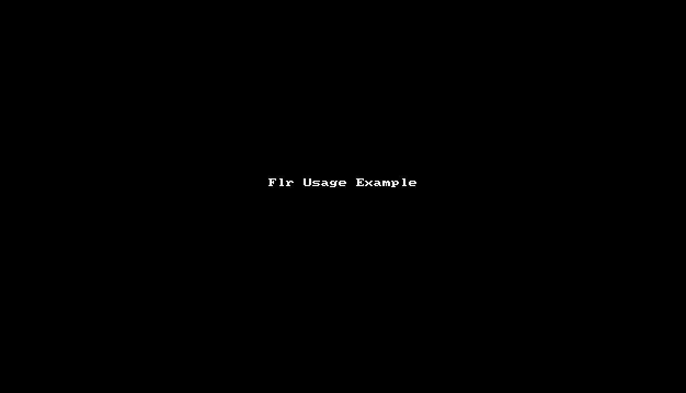

# Flr

 [](http://badge.fury.io/rb/flr) [](https://opensource.org/licenses/MIT)


`Flr`（Flutter-R）：一个类似 `AAPT`（Android Asset Packaging Tool）的`CLI`工具，用于帮助Flutter开发者在修改项目资源后，可以自动为资源添加声明到 `pubspec.yaml` 以及生成`R.dart`文件。借助`R.dart`，Flutter开发者可以在代码中通过资源ID的方式应用资源。




📖 *其他语言版本：[English](README.md)、 [简体中文](README.zh-cn.md)*

## Feature
- 支持“自动添加资源声明到 `pubspec.yaml` 和自动生成`R.dart`文件”的自动化服务，该服务可以通过手动触发，也可以通过监控资源变化触发
- 支持处理图片资源（ `.png`、 `.jpg`、 `.jpeg`、`.gif`、 `.webp`、`.icon`、`.bmp`、`.wbmp`、`.svg` ）
- 支持处理文本资源（`.txt`、`.json`、`.yaml`、`.xml`）
- 支持处理[图片资源变体](https://flutter.dev/docs/development/ui/assets-and-images#asset-variants)
- 支持处理带有坏味道的文件名的资源：
	- 文件名带有非法字符，如空格、`~`、`@`、`#` 等（非法字符是指不在合法字符集合内的字符；合法字符集合的字符有：`0-9`、`A-Z`、 `a-z`、 `_`、`$`）
	- 文件名以数字或者`_`或者`$`字符开头

## Installation & Update Flr

安装或者更新`Flr`，只需要在终端运行一句命令即可： `sudo gem install flr`。
> 若你希望在Windows系统下使用Flr，强烈建议你在[WSL(Windows Subsystem for Linux)](https://docs.microsoft.com/en-us/windows/wsl/install-win10) 环境下安装和运行。

## Uninstall Flr

卸载`Flr`，只需要在终端运行一句命令即可：  `sudo gem uninstall flr`。

## Usage

1. 初始化你的Flutter项目：

    ```
    cd flutter_project_dir
    flr init
    ```

    >`flr init`命令将会为当前项目创建一个`Flrfile.yaml`文件，以及在`pubspec.yaml`中添加 [r_dart_library](https://github.com/YK-Unit/r_dart_library) 依赖库的声明。
    >
    >**注意：**
    >
    >Flutter SDK目前处于不稳定的状态，因此若你遇到`r_dart_library`的编译错误，你可以尝试通过修改`r_dart_library`的依赖版本来修复它。
    >
    >你可以根据这个[依赖版本关系表](https://github.com/YK-Unit/r_dart_library#dependency-relationship-table)来选择`r_dart_library`的正确版本。
    
2. 打开`Flrfile.yaml`文件，然后按照文件内的提示进行编辑，配置需要`Flr`扫描的资源目录路径，如：

   ```
    assets:
    
      # config the image asset directories that need to be scanned
      # supported image assets: [".png", ".jpg", ".jpeg", ".gif", ".webp", ".icon", ".bmp", ".wbmp", ".svg"]
      # config example: - lib/assets/images
      images:
        - lib/assets/images
    
      # config the text asset directories that need to be scanned
      # supported text assets: [".txt", ".json", ".yaml", ".xml"]
      # config example: - lib/assets/texts
      texts:
        - lib/assets/jsons
        - lib/assets/yamls
   ```

3. 监控资源变化，然后自动为你的项目声明资源和创建`R.dart`：

    ```shell
    flr monitor
    ```

    > `flr monitor`命令会启动一个持续监控资源变化的服务。
    >
    > 该监控服务会对`Flrfile.yaml`中配置的资源目录进行监控，若发现这些目录下的资源有变化，就会自动执行`flr generate`命令。`flr generate`命令会对`Flrfile.yaml`中配置的资源目录进行一次资源扫描，然后为扫描到的资源添加声明到`pubspec.yaml`，并生成`R.dart`文件。
    >
    > 你可以通过手动输入`Ctrl-C`来终止这个监控服务。

4. 输入`Ctrl-C`终止监控服务


*若你希望手动触发自动化服务为你的项目自动声明资源和创建`R.dart`，你可以运行这个命令：*

```shell
flr generate
```
> *`flr generate`命令会对`Flrfile.yaml`中配置的资源目录进行一次资源扫描，然后为扫描到的资源添加声明到`pubspec.yaml`，并生成`R.dart`文件。*


**注意：** 以上所有命令都必须在你的Flutter项目的根目录下执行。

## R.dart

在你运行`flr generate`或者`flr monitor`命令后，`Flr`会根据`Flrfile.yaml`中的资源目录配置，自动扫描资源，并为扫描到的资源添加声明到`pubspec.yaml`，以及生成`R.dart`。

`R.dart`中定义了几个`R_X`资源管理类：`R_Image`、`R_Svg`、`R_Text`。这些资源管理类用于管理各自资源类型的资源ID：

- `R_Image`：管理非SVG类的图片资源（ `.png`、 `.jpg`、 `.jpeg`、`.gif`、 `.webp`、`.icon`、`.bmp`、`.wbmp`）的资源ID
- `R_Svg`：管理SVG类图片资源的资源ID
- `R_Text`：管理文本资源（`.txt`、`.json`、`.yaml`、`.xml`）的资源ID

`R.dart`可以让Flutter开发者在代码中通过资源ID的方式应用资源，以下是一些简单示例：

```dart
import 'package:flutter_r_demo/R.dart';

// sameName.png
var normalImageWidget = Image(
  width: 113,
  height: 128,
  image: R_Image.sameName,
);

// sameName.gif
var gifImageWidget = Image(
  image: R_Image.sameName_gif,
);

// $$test$.svg
var svgImageWidget = Image(
  width: 100,
  height: 100,
  image: R_Svg.a$$test$(width: 100, height: 100),
);

// $%^&test.json
var jsonString = await R_Text.a$___test_json();

// ~!@*test.yaml
var yamlString = await R_Text.a____test_yaml();

```

## Example

这里提供了一个[Flutter-R Demo](https://github.com/YK-Unit/flutter_r_demo)来展示如何在Flutter项目中使用`Flr`工具和在代码中如何使用`R.dart`。

## License

The gem is available as open source under the terms of the [MIT License](https://opensource.org/licenses/MIT).
